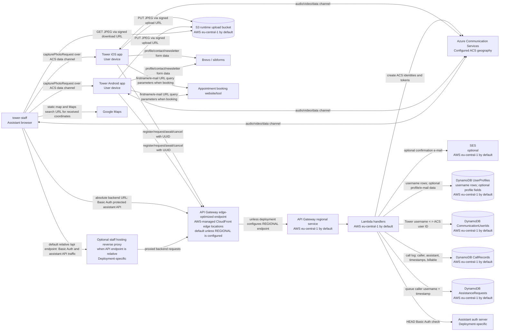

# Tower data protection documentation

This document describes the data protection-relevant technical architecture of Tower.
Tower is open source and can be deployed by different controllers.
Deployment-specific details such as the controller, administrators, exact AWS account, exact Azure Communication Services resource, authentication server, Brevo account, Google API key, and operational retention policies must be completed for each deployment.

Unless a deployment overrides it, the backend defaults to AWS region `eu-central-1`.
That places Lambda, DynamoDB, S3, SES, and the regional API Gateway service in Frankfurt, Germany.
The SAM template does not currently configure API Gateway as `REGIONAL`,
so the generated REST API uses API Gateway's default edge-optimized endpoint unless a deployment changes it.
With the edge-optimized default,
requests and headers pass through AWS-managed CloudFront edge locations before reaching the regional API Gateway service.
Azure Communication Services is configured by endpoint and access key and therefore uses the geography of the configured ACS resource.
If ACS diagnostic logging is enabled, Azure's default retention is 30 days unless the deployment changes it.

## System components

| Component | Role | Location / region | Personal data handled |
| --- | --- | --- | --- |
| Tower iOS app | Caller app for end users. | User device. | Local user UUID, optional local profile data, microphone/camera/video, photos when requested, location when requested, ACS token. |
| Tower Android app | Caller app for end users. | User device. | Local user UUID, optional local profile data, microphone/camera/video, photos when requested, location when requested, ACS token. |
| `tower-staff` web app | Assistant app. | Deployment-specific. With an absolute backend URL it can be static-asset hosting only; with the default relative API endpoint, the hosting server must reverse-proxy backend API calls and is in the protected assistant API data path. | Assistant credentials in browser authentication flow, ACS token, waiting-call metadata, in-call audio/video, caller profile shown in the session, location, requested photos. |
| API Gateway | Public backend API and Basic-auth protected assistant API. The default SAM REST API endpoint is edge-optimized unless a deployment configures a regional endpoint. | Regional service in the configured AWS region, default `eu-central-1`; edge-optimized requests pass through AWS-managed CloudFront edge locations. | Request bodies, authorization headers for assistant endpoints, caller UUIDs, assistant usernames. |
| Lambda | Tower backend handlers. | Same AWS region as the stack, default `eu-central-1`. | Caller UUIDs, ACS user IDs/tokens, assistance queue records, call records, S3 signed URL keys, optional profile/e-mail data if profile endpoints are used. |
| DynamoDB `AssistanceRequests` | Queue of callers waiting for assistance. | Same AWS region as the stack, default `eu-central-1`. | Caller username derived from UUID and request timestamp. |
| DynamoDB `CallRecords` | Operational call log. | Same AWS region as the stack, default `eu-central-1`. | Caller username, assistant username, meeting UUID, start/accept/end timestamps, billable flag. |
| DynamoDB `CommunicationUserIds` | Mapping from Tower usernames to ACS identities. | Same AWS region as the stack, default `eu-central-1`. | Caller or assistant username and ACS communication user ID. |
| DynamoDB `UserProfiles` | Backend user/profile table. | Same AWS region as the stack, default `eu-central-1`. | Username rows for created caller/assistant identities; optional first name, last name, gender, birthdate, phone, and e-mail if profile endpoints are used. |
| S3 runtime upload bucket | Temporary photo exchange between caller app and staff app. | Same AWS region as the stack, default `eu-central-1`. | JPEG photos requested by assistants during calls. |
| SES | Optional e-mail sender for profile e-mail confirmation. | Same AWS region as the stack, default `eu-central-1`. | Recipient e-mail address and confirmation e-mail metadata when backend profile e-mail is used. |
| Azure Communication Services | Real-time calls, data channels, identities, and call tokens. | Configured Azure ACS resource geography. | Audio/video, data-channel messages, ACS user IDs, access tokens, call diagnostics if enabled. |
| Assistant authentication server | Verifies assistant Basic Auth credentials for protected backend endpoints. | Deployment-specific. | Assistant usernames and authentication secrets. |
| Google Maps | Shows caller location to assistants in `tower-staff`. | Google service; storage/processing location is determined by the Google Maps configuration and terms. | Location coordinates sent by the caller app and displayed as Static Maps / Maps links in the staff app. |
| Brevo / sibforms | Newsletter/contact handoff from caller apps. | Brevo account configuration; separate from Tower backend. | First name, last name, and e-mail submitted by the apps when the user chooses the newsletter/contact flow. |
| Appointment booking website/tool | Appointment booking opened by caller apps when the service is closed. | `tower-assist.de` website and booking provider are deployment-specific. | Locally stored first name and e-mail when present, sent as URL query parameters. |

## Data flow diagram

## Normal processing flows

### Caller registration and assistance queue

1. The iOS or Android app creates or receives a random UUID using `POST /registerUser`.
   The UUID is stored locally and is the app instance's lightweight identifier.
   There are no real caller accounts in the current architecture.
   `POST /registerUser` also accepts optional profile fields.
   If an e-mail address is provided,
   the backend validates uniqueness,
   sends a confirmation e-mail through SES when mail is configured,
   and stores the supplied profile fields in DynamoDB `UserProfiles`.
2. The backend maps the UUID to an internal username of the form `user_<uuid>`.
   It creates or reuses an Azure Communication Services user and stores the mapping in DynamoDB `CommunicationUserIds`.
   New users also get a DynamoDB `UserProfiles` row containing at least the username and any optional fields supplied to `POST /registerUser`.
3. When the caller requests assistance, the app sends the UUID to `POST /requestAssistance`.
   Lambda issues an ACS token with `voip.join` scope and writes an `AssistanceRequests` queue item.
4. The caller app keeps the queue item alive through `POST /awaitAssistance`.
   The queue item TTL is refreshed while the caller is waiting.
5. If the caller cancels before being connected, the app calls `POST /cancelAssistance`.
   The backend deletes the queue item and writes a non-billable call record for the abandoned request.

### Assistant authentication and call handling

`tower-staff` is built with `REACT_APP_TOWER_API_ENDPOINT`.
If this value is an absolute backend URL,
the staff web server only serves static assets and the browser calls API Gateway directly.
If this value is a relative path such as the default `/api`,
the staff hosting server must reverse-proxy those requests to the backend.
In that deployment shape,
the hosting/proxy component can process assistant Basic Auth headers,
browser credentials,
protected assistant endpoint traffic,
waiting-call metadata,
photo URL requests,
and backend responses.
Its provider,
location,
request-log retention,
and administrative access controls must be covered in the deployment-specific data protection documentation.

1. Each assistant has a personal account in a deployment-specific authentication server.
   Assistant accounts are created and deleted manually by administrators.
2. Protected assistant endpoints use API Gateway's Lambda authorizer.
   The authorizer forwards the Basic Auth header to the configured `AUTH_URL` using a `HEAD` request.
   Authorization is cached by API Gateway for five minutes.
3. `tower-staff` calls `GET /assistanceToken` to receive an ACS token with `voip` scope and a 12-hour lifetime.
4. `tower-staff` polls `GET /offerAssistance` for pending assistance requests.
5. `tower-staff` calls `POST /beginAssistance` to pop the oldest request from the queue.
   The backend writes a `CallRecords` item containing caller username, assistant username, start timestamp, accept timestamp, meeting UUID, and `Billable=true`.
   The response includes the caller's merged `UserProfiles` and ACS identity object;
   if optional profile fields are present,
   they are disclosed to the assistant browser and can also appear in the current staff browser console logging.
6. The backend exposes `POST /endAssistance` so an authenticated assistant can close an open call record with the meeting UUID and optional `nonBillable` flag.
   If this endpoint is called,
   the backend records the end timestamp and billable flag.
   The current `tower-staff` app does not call this endpoint in its normal answered-call flow,
   so answered call records usually do not receive an end timestamp unless another integration calls it.

### Real-time call content

Audio, video, and data-channel messages flow through Azure Communication Services.
The Tower backend does not receive or store the audio/video media stream.
If ACS diagnostic logging is enabled for a deployment, Azure may store diagnostic records for the configured retention period;
by default, this is 30 days.

The caller apps send data-channel messages during the call, including:

- `userHelloEvent` with client identifier/version and optional local user profile.
- `orientationEvent` for video orientation.
- `locationResponse` and `locationEvent` after the assistant requests location and the app/user allows location access.
- `capturePhotoResponse` after a requested photo was captured and uploaded.
- `switchCameraResponse` and `toggleTorchResponse` after requested camera-control actions.
- Error variants of response/event messages, including `capturePhotoResponse`, `locationResponse`, `locationEvent`, and `errorEvent`.
- `photoDataEvent` only for legacy in-channel photo transfer.

The staff app sends these data-channel messages during the call:

- `capturePhotoRequest` to request a photo.
- `locationRequest` to request location updates.
- `switchCameraRequest`, `toggleTorchRequest`, `holdEvent`, `resumeEvent`, and `videoToggleEvent` for call control.

The current staff web app writes received and sent data-channel messages to the browser console.
Depending on the browser and developer-tools state,
this can expose profile data, location coordinates, errors, and legacy in-channel photo data on the assistant device during or after the session.
Tower does not send those browser-console logs back to the backend.

There is no technical in-app permission workflow for assistant requests such as taking a photo during a call.
Permission is requested verbally in the call by the assistant.
Platform permission prompts still apply for camera, microphone, and location access.

### Photos

Photos are requested by assistants through the ACS data channel.
The backend creates a pre-signed S3 upload URL for the caller app.
The upload URL expires after 5 minutes.
The caller app uploads a JPEG directly to S3 and reports the object key back to `tower-staff`.
The staff app requests a pre-signed S3 download URL from the backend.
The download URL expires after 120 minutes.
The S3 bucket has a lifecycle rule that expires uploaded objects after 1 day; actual deletion can happen asynchronously after lifecycle expiry.

The technical authorization boundary for photo URL creation is the assistant's Basic Auth login only.
The backend does not bind upload or download URL requests to a specific call,
caller,
meeting,
or assistant.
Any authenticated assistant can create an upload URL at any time,
and can request a download URL for any S3 object key in the upload bucket while that object still exists.

### Location and maps

Location is only transmitted after the assistant requests it during a call and the caller app has access to location services.
The caller app sends coordinates and optional accuracy/altitude/course values over the ACS data channel to `tower-staff`.
`tower-staff` renders a map with Google Static Maps and provides a Google Maps search link.
The backend does not store location coordinates.

### Local profile data

The iOS and Android caller apps can store optional user profile data locally:
first name, last name, gender, birthdate, phone, and e-mail.
This local profile is sent to the assistant in a `userHelloEvent` at the beginning of the call.
It is not retained by the Tower backend in the current normal architecture.

The backend contains profile-capable endpoints and a `UserProfiles` DynamoDB table.
Normal registration and assistance flows can create rows containing only the Tower username.
`POST /registerUser` is also an optional public profile intake path:
if its request body includes profile fields,
the backend stores them in `UserProfiles`,
and if it includes an e-mail address,
the backend validates it and sends an SES confirmation e-mail when configured.
`POST /getUser` and `POST /updateUser` can read and update the same profile rows by bearer UUID.
The richer profile fields and optional e-mail confirmation through SES are incomplete and are not used by the current caller apps as part of the normal architecture.
If a deployment enables and uses these profile fields, that profile data and optional e-mail confirmation become part of that deployment's processing and must be documented specifically.

### Newsletter/contact handoff

The caller apps can submit first name, last name, and e-mail to Brevo/sibforms for contact or newsletter purposes.
This is a separate concern from the Tower backend.
Tower only feeds the data into Brevo;
retention and further processing are governed by the deployment's Brevo configuration and the relevant privacy notice.

### Appointment booking handoff

When Tower is closed, the caller apps can open `https://tower-assist.de/terminvereinbarung/` for appointment booking.
If the app has locally stored first name or e-mail values,
it appends them as `firstname` and `email` URL query parameters.
Those URL parameters are sent to the website/booking tool and may also be visible in browser history, hosting logs, proxies, analytics, and referrer handling depending on the deployment.

## Permissions concept (Berechtigungskonzept)

### Roles

| Role | Access | Notes |
| --- | --- | --- |
| Caller / app user | Can use public caller endpoints with the local UUID; can participate in ACS calls; can provide camera, microphone, location, photo, and profile data during a call. | No real caller accounts currently exist. The UUID is a moderately sensitive logging identifier because it links requests and call records. |
| Assistant / staff | Has a personal account in the authentication server; can access Basic-auth protected backend endpoints through `tower-staff`; can see waiting calls, accept calls, receive caller profile shown in-call, request photos/location, and see received photos/location during the session. Any authenticated assistant can also create photo upload URLs and download any uploaded photo by object key while it exists, because these backend endpoints are not scoped to a specific call, caller, meeting, or assistant. | Accounts are created and deleted manually by administrators. |
| Administrator | Has deployment-level access to AWS, Azure, hosting, logs, authentication server, and related configuration. | The concrete list of administrators and their exact access rights is deployment-specific and out of scope for this repository-level document. |
| Lambda functions | Use generated SAM IAM roles with permissions assigned per handler and AWS resource. | The policies are scoped by handler responsibility, but some generated policies grant broad actions on the relevant DynamoDB table, and SES send permission is currently granted with `Resource: '*'`. |
| Support | No separate support access is defined. | Operational access, if any, is administrator access. |

### Public caller endpoints

These endpoints do not require assistant authentication:

- `GET /` returns status, API version, and opening hours.
- `POST /registerUser` creates a UUID-backed Tower/ACS identity and can optionally ingest profile fields.
  If an e-mail address is supplied,
  it validates the address,
  checks for duplicate profile e-mail use,
  sends an SES confirmation e-mail when configured,
  and stores the supplied profile fields in `UserProfiles`.
- `POST /requestAssistance` creates or refreshes the Tower/ACS identity, returns an ACS token, and queues the caller.
- `POST /awaitAssistance` keeps the assistance request alive.
- `POST /cancelAssistance` removes the assistance request and logs an abandoned call.
- `POST /getUser` and `POST /updateUser` are optional/incomplete profile endpoints and are not part of the current normal app architecture.

Because caller UUIDs are bearer-like identifiers, apps and administrators should treat them as moderately sensitive.
For the public caller and profile endpoints, possession of the UUID is the effective access control.
In particular, `POST /registerUser` lets any caller/API client submit optional profile fields for a new `UserProfiles` row,
`POST /getUser` lets any caller who knows a `userId` read the corresponding `UserProfiles` row,
and `POST /updateUser` lets any caller who knows a `userId` update that row and, when e-mail is configured, trigger the optional SES confirmation e-mail flow.
If richer profile fields are used in a deployment,
that deployment must account for this bearer-UUID read/write model and the resulting exposure risk.

### Assistant endpoints

These endpoints are protected by Basic Auth through the API Gateway Lambda authorizer:

- `GET /assistanceToken` returns an ACS token for the authenticated assistant.
- `GET /offerAssistance` returns the oldest queued assistance request, if any.
- `POST /beginAssistance` accepts a queued request and creates a call record.
- `POST /endAssistance` closes an open call record for the authenticated assistant.
- `POST /createImageUploadUrl` creates a signed S3 upload URL for a caller photo.
- `POST /createImageDownloadUrl` creates a signed S3 download URL for an uploaded photo.

Photo URL endpoints are authorized only at the assistant-account level.
They do not check that the assistant is currently in a call,
that a caller requested or approved the action,
or that a requested object key belongs to that assistant or meeting.

The authorizer identifies the assistant by the Basic Auth username.
That username becomes the `Assistant` value in call records.

### Cloud and admin access

Administrators can access AWS, Azure, hosting, logs, and the authentication server for their deployment.
The repository cannot state which humans have those permissions.
MFA, break-glass access, and administrator assignment are deployment governance topics rather than application architecture.

The AWS Lambda functions use generated IAM roles with permissions assigned by handler responsibility:
queue handlers access `AssistanceRequests`, call logging handlers access `CallRecords`, identity handlers access `CommunicationUserIds`, and photo URL handlers access the upload bucket.
These policies are resource-scoped where the SAM policy template supports it,
but they are not action-minimal least-privilege policies:
several handlers use broad `DynamoDBCrudPolicy` permissions on their assigned tables,
and handlers that can send optional profile confirmation e-mail have `ses:SendEmail` permission with `Resource: '*'`.

## Deletion concept (Löschkonzept)

This section documents implemented technical deletion behavior.
Policy retention periods that are not implemented in code must be set by the deployment operator.

| Data category | Storage | Implemented deletion / retention |
| --- | --- | --- |
| Assistance queue item | DynamoDB `AssistanceRequests`. | TTL is refreshed while waiting and set to about 30 seconds after the last keepalive. The item is also deleted when an assistant begins the call or the caller cancels. DynamoDB TTL deletion is asynchronous after expiry. The table is deleted when the stack is deleted. |
| Abandoned call record | DynamoDB `CallRecords`. | No automatic deletion. The table has `DeletionPolicy: Retain` and `UpdateReplacePolicy: Retain`, so records remain until manually deleted or a deployment adds a retention mechanism. |
| Answered call record | DynamoDB `CallRecords`. | No automatic deletion. Same retained table behavior as abandoned call records. The backend can store an end timestamp through `POST /endAssistance`, but the current `tower-staff` app does not call that endpoint in the normal flow. |
| Tower UUID / username records and related call logs | DynamoDB `CommunicationUserIds`, `UserProfiles`, and `CallRecords`. | No automatic deletion. All three tables are retained on stack deletion/replacement. If a caller wants the logging identifier removed, an administrator must delete matching rows from `CommunicationUserIds` and `UserProfiles` and delete or anonymize `CallRecords` rows where `Caller` equals `user_<uuid>`. |
| ACS communication identity | Azure Communication Services. | ACS tokens expire, but Tower does not implement automatic ACS identity deletion or token revocation. Deletion requests require a deployment/admin procedure in Azure in addition to DynamoDB cleanup. |
| Caller account | Not implemented. | There are currently no real caller accounts and therefore no automated account deletion flow. Account work is in flight and not part of this architecture yet. |
| Optional backend profile fields | DynamoDB `UserProfiles`. | Richer profile fields are not used by the current caller apps. If used, there is no automatic deletion; the table is retained on stack deletion/replacement. Manual deletion must remove the affected `UserProfiles` item or fields. |
| Local caller profile data on iOS | UserDefaults on the user's device. | Retained until the user edits/removes values, resets app data, deletes the app, or device/iCloud backup retention removes it. |
| Local caller profile data on Android | AndroidX DataStore on the user's device. | Retained until the user clears profile values, clears app data, deletes the app, or Android backup retention removes it. The manifest currently allows backup and includes all data in cloud backup rules. |
| Local caller UUID on iOS | UserDefaults on the user's device. | Retained until app data is reset/deleted or manually changed by app behavior. |
| Local caller UUID on Android | AndroidX DataStore on the user's device. | Retained until app data is reset/deleted or manually changed by app behavior. Android backup may preserve it according to device/account backup behavior. |
| Photos uploaded during calls | S3 runtime upload bucket. | Upload URL expires after 5 minutes; download URL expires after 120 minutes; bucket lifecycle expires objects after 1 day, with actual deletion happening asynchronously after lifecycle expiry. |
| Audio/video media | ACS real-time service. | Tower backend does not store media. ACS diagnostic logging retention is deployment-specific; default is 30 days if logging is enabled. |
| Data-channel messages | ACS real-time service, staff/caller app memory, and staff browser console. | Tower backend does not persist messages except when a photo is uploaded through S3. Staff app state is in browser memory during the call. The staff app also logs sent and received messages to the browser console; retention is browser/devtools-dependent on the assistant device. |
| Staff hosting/reverse-proxy logs | Staff hosting server, only when `REACT_APP_TOWER_API_ENDPOINT` is a relative path and backend requests are proxied through the hosting server. | Retention is deployment-specific. Operators should either disable personal-data request/response logging for the proxy path or define deletion/retention for logs that may contain Basic Auth headers, assistant usernames, caller UUIDs, waiting-call metadata, photo object keys, and backend responses. |
| Lambda logs | CloudWatch Logs. | No log retention is configured in the SAM template, so AWS keeps logs indefinitely by default unless the deployment configures retention. Logs can include caller UUIDs, assistant usernames, photo object keys, meeting UUIDs, and operational errors; logs should avoid secrets. |
| API Gateway access/execution logs | AWS API Gateway / CloudWatch if enabled. | Not configured in the SAM template. If enabled by the deployment, retention is deployment-specific. |
| SES e-mail metadata | SES / AWS service logs. | Only applies if optional profile e-mail is used. Retention is governed by AWS service behavior and deployment logging configuration. |
| Brevo newsletter/contact records | Brevo. | Managed outside the Tower backend. Retention/deletion must be configured in the Brevo account and privacy process. |
| Google Maps requests | Google Maps. | Managed by Google Maps terms and the deployment's Google configuration. Tower backend does not store map requests. |
| Appointment booking handoff data | Appointment website/tool, browser history, and possible proxy/hosting logs. | Managed outside the Tower backend. Retention/deletion must be configured in the website/booking provider and operational privacy process. |

## Technical input for VVT and privacy notice

This section is technical input only.
It is not a legal privacy notice.
The controller and data protection advisor must turn it into deployment-specific VVT/privacy text.

### Data categories and purposes

| Data category | Examples | Purpose | Source | Recipients / processors | Storage location |
| --- | --- | --- | --- | --- | --- |
| App instance identifier | UUID, `user_<uuid>`. | Recognize one caller app instance across requests and call logs; create ACS identity. | Caller app. | AWS Lambda/DynamoDB, Azure Communication Services. | User device, AWS region default `eu-central-1`, configured ACS geography. |
| Assistant identity | Basic Auth username, assistant ACS user ID. | Authenticate assistants, issue ACS tokens, attribute call records. | Assistant / authentication server. | AWS API Gateway/Lambda/DynamoDB, Azure Communication Services, authentication server. | Deployment-specific auth server, AWS region default `eu-central-1`, configured ACS geography. |
| Authentication secret | Basic Auth password. | Verify assistant access. | Assistant. | Authentication server; API Gateway/Lambda forwards authorization header for verification; AWS-managed CloudFront edge locations when the API uses the default edge-optimized endpoint. | Deployment-specific auth server; transiently processed by API Gateway/Lambda and, by default, the edge-optimized API Gateway path. |
| Call queue metadata | Caller username, request timestamp, queue position. | Match callers with assistants. | Caller app/backend. | AWS Lambda/DynamoDB, staff app. | AWS region default `eu-central-1`; assistant browser during polling/call handling. |
| Call log metadata | Caller username, assistant username, meeting UUID, start/accept/end timestamps, billable flag. | Operational records and billing/usage accounting. | Backend/staff app. | AWS Lambda/DynamoDB, administrators. | AWS region default `eu-central-1`; retained table unless manually deleted. |
| Audio and video | Microphone audio, live camera stream, assistant audio/video. | Real-time assistance call. | Caller and assistant devices. | Azure Communication Services; caller/staff apps. | Configured ACS geography; not stored by Tower backend. |
| Data-channel control messages | Photo/location/camera/torch/hold/resume/video toggle events and errors. | Operate the assistance session. | Caller and staff apps. | Azure Communication Services; counterpart app; staff browser console for current staff app logging. | Real-time ACS transport, app memory, and browser/devtools-dependent staff console retention; not stored by Tower backend. |
| Location | Latitude, longitude, optional altitude, accuracy, course. | Let assistant locate the caller when requested during a call. | Caller device location services. | Azure Communication Services, staff app, Google Maps. | Real-time ACS transport, assistant browser memory and possibly browser console, Google Maps request processing; not stored by Tower backend. |
| Photos | JPEG image captured from caller camera on assistant request. | Let assistant inspect caller surroundings during assistance. | Caller device camera. | S3 runtime bucket, staff app, AWS Lambda for signed URLs. | AWS region default `eu-central-1`; S3 lifecycle expiry after 1 day, with deletion happening asynchronously after expiry. |
| Local caller profile | First name, last name, gender, birthdate, phone, e-mail. | Give assistant context during call; feed contact/newsletter flow when chosen; prefill appointment booking when opened. | Caller. | Staff app over ACS data channel; Brevo if submitted; appointment booking website/tool if opened; locally on caller device. | User device; assistant browser memory and possibly browser console during call; Brevo account if submitted; website/booking provider if opened. |
| Backend user/profile table data | Username; optionally first name, last name, gender, birthdate, phone, e-mail. | Store created Tower identities; optional/incomplete backend profile feature; show caller profile context to assistants when a call is accepted. | Backend, `POST /registerUser`, and optional profile API clients. | AWS Lambda/DynamoDB; staff app and assistant browser through `POST /beginAssistance`; SES for e-mail confirmation if optional e-mail is used. | AWS region default `eu-central-1`; assistant browser memory and possibly browser console during accepted calls; username rows are part of normal identity creation; richer profile fields only if supplied to `POST /registerUser` or profile endpoints. |
| E-mail confirmation data | Recipient e-mail address and confirmation message. | Confirm optional backend profile e-mail address. | `POST /registerUser` or optional profile update endpoint. | AWS SES. | AWS region default `eu-central-1`; only if profile e-mail is supplied and mail is configured. |
| Newsletter/contact form data | First name, last name, e-mail, newsletter choice. | Contact request or newsletter signup. | Caller app. | Brevo / sibforms. | Brevo account configuration. |
| Appointment booking handoff data | First name and e-mail in URL query parameters. | Open appointment booking with locally stored caller details prefilled. | Caller app local profile. | `tower-assist.de` website, booking tool/provider, and possible browser/proxy/hosting logs. | Deployment-specific website/booking infrastructure; user's browser history. |
| Technical logs | Caller UUIDs, assistant usernames, photo keys, meeting IDs, timestamps, errors, staff browser console messages, and optional staff reverse-proxy request logs. | Operations, troubleshooting, security monitoring; current staff client-side diagnostics. | Backend, cloud services, staff browser, and optional staff hosting reverse proxy. | AWS CloudWatch/API Gateway/Lambda; AWS-managed CloudFront edge locations for the default edge-optimized API endpoint; Azure diagnostics if enabled; assistant device/browser console; staff hosting provider if relative API calls are proxied. | AWS region default `eu-central-1`; AWS-managed CloudFront edge locations for the default API endpoint; ACS diagnostics in configured Azure logging workspace/geography if enabled; browser/devtools-dependent local retention; deployment-specific staff hosting/proxy location if used. |
| iOS privacy manifest declarations | Collected data types include e-mail address, name, product interaction, and user ID; declared purposes include Developer Advertising and Analytics. | Apple disclosure for the current iOS app. | iOS app metadata. | Apple App Store disclosure. | Apple App Store / user device. |

### Processors and sub-processors to review per deployment

- AWS: API Gateway, AWS-managed CloudFront edge locations for the default edge-optimized API endpoint, Lambda, DynamoDB, S3, SES, CloudWatch Logs, and CloudFormation/SAM deployment artifacts.
- Microsoft Azure: Azure Communication Services, and optionally Log Analytics / diagnostic settings.
- Authentication server/provider for assistant accounts.
- Hosting provider for `tower-staff` static assets.
  If `REACT_APP_TOWER_API_ENDPOINT` is relative, this provider also runs the reverse proxy for protected backend API calls and must be assessed for provider identity, hosting location, request-log retention, and administrator/access controls.
  If the staff app uses an absolute backend URL, this provider is static-asset hosting only.
- Website/booking provider for appointment booking opened by the caller apps.
- Google Maps Platform for location display in the assistant web app.
- Brevo for newsletter/contact form submissions from the caller apps.
- Apple and Google platform services for app distribution, platform permission prompts, and mobile backup behavior.

### Platform permissions and disclosures

The caller apps need camera and microphone access for calls.
They need location access only when the assistant requests location during a call.
Android declares `READ_PHONE_STATE` and `ACCESS_WIFI_STATE` because they are used by the ACS SDK;
it also declares network, camera, microphone, coarse location, and fine location permissions.
iOS declares the WiFi Info entitlement because it is used by the ACS SDK.

The iOS privacy manifest declares collected data types for e-mail address, name, product interaction, and user ID.
The project notes that location and similar in-call data are used in real time and are not stored by the Tower backend.
Photos are different operationally:
when an assistant requests a photo,
the caller app uploads the JPEG to the Tower S3 bucket and it is retained temporarily until the 1-day lifecycle expiry deletes it asynchronously.
The current App Store disclosure assessment treats these in-call uses as outside Apple's collection definition for this app.

## Deployment-specific checklist

For each Tower deployment, fill in or verify:

1. Controller name and contact details.
2. AWS account, AWS region, stack name, API Gateway endpoint type (`EDGE` default or `REGIONAL`), and CloudWatch/API Gateway log retention.
3. Azure ACS resource geography and whether ACS diagnostics / Log Analytics are enabled.
4. Authentication server/provider for assistant accounts and its retention/deletion process.
5. Staff web app URL, `REACT_APP_TOWER_API_ENDPOINT` value, whether the hosting server proxies relative API requests, and whether proxy/static request logs are retained.
6. Appointment booking website/tool, provider, log retention, and URL query parameter handling.
7. Google Maps project/API key owner and applicable Maps terms.
8. Brevo account/list/form owner, opt-in process, and deletion process.
9. Administrator group and local operational procedure for manual deletion of caller UUID mappings, `UserProfiles` rows, ACS identities, and `CallRecords` rows that reference the caller username.
